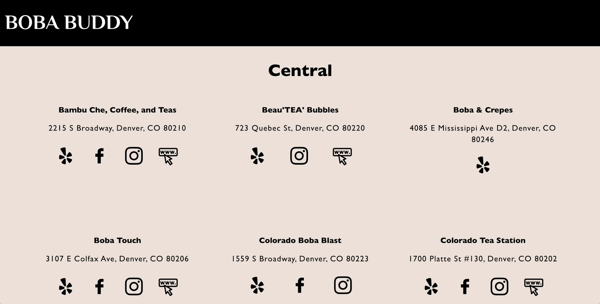
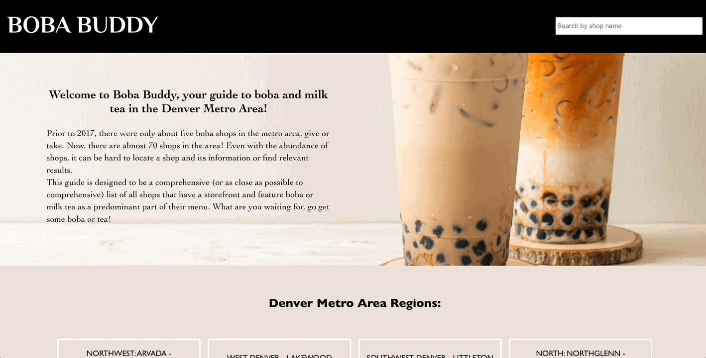

# Boba Buddy

## Overview
**Boba Buddy** is a website that allows for a user to view a comprehensive list of boba and milk tea shops in the Denver Metro Area as filtered by region. Although there is now an abudance of boba and milk tea shops, it can still be hard to find relevant results and/or information when searching on the internet. Shops included in this app are those with their own storefront and those that feature boba and/or milk tea as a significant part of their menus. Compiled in an easy to navigate format, users can obtain a shop's name and address and be directed to the shop's various social media links or websites. Users can also search for a shop by name.

#### Goals
- Demonstrate competence with React, Router, asynchornous JavaScript, and end-to-end testing with Cypress
- Implement self-learning goals such as building an [API in Express](https://github.com/kpn678/boba-buddy-api) and implementing React Hooks and Async/await
- Work within constraints to deliver a product that solves a unique problem for a specific audience

#### Project Specs
The rubric and specs can be found [here](https://frontend.turing.edu/projects/module-3/showcase.html).

## Deployed Links
- [Website Link](https://dnvr-boba-buddy.herokuapp.com/)
- [API Link](https://dnvr-boba-buddy-api.herokuapp.com/)

## Set Up
1. Fork this [repository](https://github.com/kpn678/boba-buddy), and clone it into your local machine.
2. Navigate into the repository and run `npm install` from your command line.
3. To view the app running inside the local host, run `npm start`.
4. To begin testing, run `npm run cypress` in a separate tab from local host tab.

## Visual Walkthrough
- User can view a list of Denver Metro Area regions on the home page

- User can view a list of shops in a certain region and click on a link icon to be directed to an external website

- User can search for a shop by name and see a list of shops matching that name

## Technologies Implemented
- Javascript/HTML (JSX)
- CSS
- React
- React Router
- Cypress
- Express

## Future Directions
- Improve mobile responsiveness
- Add save, local storage, and delete functionalities so the user can add shops they want to visit to their own list and delete them as they want
- Use Leaflet or Google Maps libraries to include an interactive map(s) on the website

## Contributors
- [Kristy Nguyen](https://www.linkedin.com/in/kristypnguyen/)
